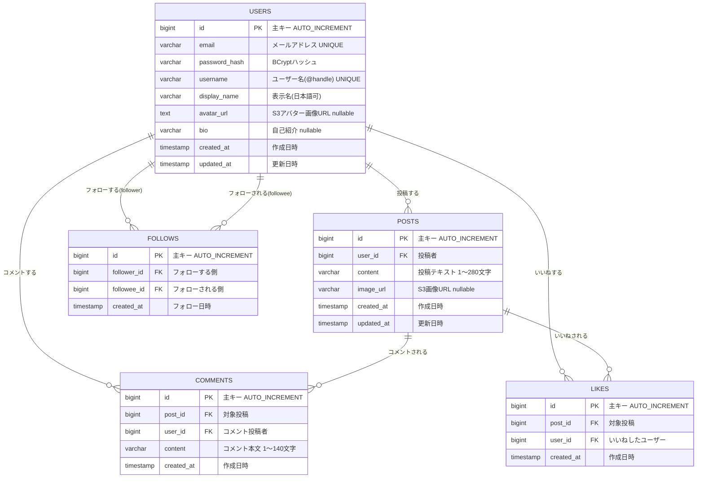

# ER図 / DB設計

## ER図



---

## テーブル定義

### users

| カラム名 | 型 | NULL | デフォルト | 説明 |
|---------|---|------|-----------|------|
| id | BIGINT | NOT NULL | AUTO_INCREMENT | 主キー |
| email | VARCHAR(255) | NOT NULL | — | メールアドレス |
| password_hash | VARCHAR(255) | NOT NULL | — | BCryptハッシュ |
| username | VARCHAR(50) | NOT NULL | — | ユーザー名（英数字・_・- のみ。@handle 兼ログイン識別子） |
| display_name | VARCHAR(50) | NOT NULL | — | 表示名（日本語可。画面表示用。V3 で追加） |
| avatar_url | TEXT | NULL | NULL | S3アバター画像URL |
| bio | VARCHAR(160) | NULL | NULL | 自己紹介 |
| created_at | TIMESTAMP | NOT NULL | 現在時刻 | 作成日時 |
| updated_at | TIMESTAMP | NOT NULL | 現在時刻 | 更新日時 |

**インデックス**
- PRIMARY KEY: `id`
- UNIQUE: `email`
- UNIQUE: `username`

---

### posts

| カラム名 | 型 | NULL | デフォルト | 説明 |
|---------|---|------|-----------|------|
| id | BIGINT | NOT NULL | AUTO_INCREMENT | 主キー |
| user_id | BIGINT | NOT NULL | — | FK: users.id（CASCADE DELETE） |
| content | VARCHAR(280) | NOT NULL | — | 投稿テキスト |
| image_url | VARCHAR(500) | NULL | NULL | S3画像URL（V8 で追加） |
| created_at | TIMESTAMP | NOT NULL | 現在時刻 | 作成日時 |
| updated_at | TIMESTAMP | NOT NULL | 現在時刻 | 更新日時 |

**インデックス**
- PRIMARY KEY: `id`
- INDEX: `created_at DESC` (`idx_posts_created_at`) — タイムライン新着順取得を高速化

---

### comments

| カラム名 | 型 | NULL | デフォルト | 説明 |
|---------|---|------|-----------|------|
| id | BIGINT | NOT NULL | AUTO_INCREMENT | 主キー |
| post_id | BIGINT | NOT NULL | — | FK: posts.id |
| user_id | BIGINT | NOT NULL | — | FK: users.id |
| content | VARCHAR(140) | NOT NULL | — | コメント本文 |
| created_at | TIMESTAMP | NOT NULL | 現在時刻 | 作成日時 |

**インデックス**
- PRIMARY KEY: `id`
- INDEX: `post_id` — 投稿ごとのコメント一覧取得を高速化

**CASCADE**
- posts 削除時に連鎖削除

---

### likes

| カラム名 | 型 | NULL | デフォルト | 説明 |
|---------|---|------|-----------|------|
| id | BIGINT | NOT NULL | AUTO_INCREMENT | 主キー |
| post_id | BIGINT | NOT NULL | — | FK: posts.id |
| user_id | BIGINT | NOT NULL | — | FK: users.id |
| created_at | TIMESTAMP | NOT NULL | 現在時刻 | 作成日時 |

**インデックス**
- PRIMARY KEY: `id`
- UNIQUE: `(post_id, user_id)` — 重複いいね防止
- INDEX: `post_id` — 投稿ごとのいいね件数取得を高速化

**CASCADE**
- posts 削除時に連鎖削除

---

### follows

| カラム名 | 型 | NULL | デフォルト | 説明 |
|---------|---|------|-----------|------|
| id | BIGINT | NOT NULL | AUTO_INCREMENT | 主キー |
| follower_id | BIGINT | NOT NULL | — | FK: users.id（フォローする側・CASCADE DELETE） |
| followee_id | BIGINT | NOT NULL | — | FK: users.id（フォローされる側・CASCADE DELETE） |
| created_at | TIMESTAMP | NULL | 現在時刻 | フォロー日時（DEFAULT CURRENT_TIMESTAMP） |

**インデックス**
- PRIMARY KEY: `id`
- UNIQUE: `(follower_id, followee_id)` — 重複フォロー防止
- INDEX: `follower_id` — フォロー中一覧取得を高速化
- INDEX: `followee_id` — フォロワー一覧取得を高速化

---

### refresh_tokens

アクセストークン（15分）失効時に再発行するためのリフレッシュトークンを管理する（V2 で作成）。HttpOnly Cookie で送られる不透明トークン（UUID）を DB 側で検証する。

| カラム名 | 型 | NULL | デフォルト | 説明 |
|---------|---|------|-----------|------|
| id | BIGINT | NOT NULL | AUTO_INCREMENT | 主キー |
| user_id | BIGINT | NOT NULL | — | FK: users.id（CASCADE DELETE） |
| token | VARCHAR(512) | NOT NULL | — | リフレッシュトークン文字列（UUID） |
| expires_at | TIMESTAMP | NOT NULL | — | 有効期限（7日間） |
| created_at | TIMESTAMP | NOT NULL | 現在時刻 | 作成日時 |

**インデックス**
- PRIMARY KEY: `id`
- UNIQUE: `token`
- INDEX: `token` — トークン検証を高速化
- INDEX: `user_id` — ユーザー単位の一括失効（全デバイスログアウト）用

---

## TypeScript 型定義（フロントエンド参考）

```ts
type User = {
  id: number;
  username: string;
  displayName: string;
  avatarUrl: string | null;
  bio: string | null;
  followingCount: number;
  followerCount: number;
  createdAt: string;
};

type Post = {
  id: number;
  user: User;
  content: string;
  imageUrl: string | null;
  likeCount: number;
  commentCount: number;
  liked: boolean; // ログインユーザーがいいね済みかどうか
  createdAt: string;
  updatedAt: string;
};

type Comment = {
  id: number;
  postId: number;
  user: User;
  content: string;
  createdAt: string;
};
```
